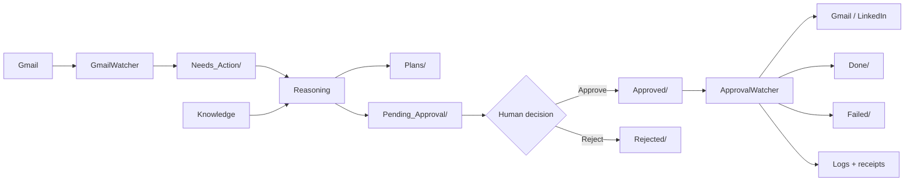

# ChiefMind Agent Reference

This file documents runtime agents and their contracts. All Python agents import
paths and settings from `scripts/config.py`; workflow paths must never be
hardcoded in agent code.

## Workflow contract

No external action is authorized by an LLM classification. Authorization occurs
only when a human moves the exact artifact from `Pending_Approval/` to
`Approved/` through the protected dashboard endpoint.

## Gmail authentication setup

| Field | Contract |
| --- | --- |
| Trigger | Operator runs `authenticate_gmail.py` during setup or reauthorization |
| Input | `credentials/credentials.json`, configured Gmail scopes |
| Output | Owner-readable `credentials/token.json` |
| What it does | Runs Google OAuth in a browser, validates scopes, refreshes tokens, and saves tokens atomically |

This is an interactive setup utility, not a background agent.

## Gmail watcher

| Field | Contract |
| --- | --- |
| Trigger | Starts as a daemon; polls every `GMAIL_POLL_INTERVAL` seconds, or once with `--once` |
| Input | Gmail API messages matching `GMAIL_QUERY`; `processed_ids.json` |
| Output | `Needs_Action/email_<gmail_id>.md`, updated processed IDs, agent log; marks Gmail message read |
| What it does | Retrieves unseen messages with retry/backoff, extracts full plain text, creates deterministic YAML/Markdown artifacts, then invokes the reasoning agent after new work arrives |

The globally unique Gmail message ID prevents filename collisions. A message ID
is persisted only after staging succeeds.

## Reasoning agent

| Field | Contract |
| --- | --- |
| Trigger | Gmail watcher invokes it after staging mail; operator may run it manually |
| Input | `Needs_Action/*.md`, operator policy YAML, knowledge retrieval, Groq model |
| Output | `Logs/digests/` and `Logs/decisions/` audit entries; `Plans/` + `Pending_Approval/` when human approval is required; source removed from `Needs_Action/` to `Done/`; malformed inputs move to `Failed/` |
| What it does | Assesses events with structured enums (no numeric scores), applies a deterministic policy engine, auto-summarizes low-impact mail into daily digests, drafts at temperature `0.3` when approval is required, and produces an approval artifact containing the exact proposed text |

Before any LLM call it checks `action_id` across `Pending_Approval/`,
`Approved/`, `Rejected/`, and `Done/`. The approval artifact includes an integrity hash for
the immutable `draft_body`. External sends still require dashboard approval only.

## Job search agent

| Field | Contract |
| --- | --- |
| Trigger | Supervisor startup when `JOB_SEARCH_ENABLED=true`; repeats every `JOB_SEARCH_INTERVAL` seconds |
| Input | Public remote-job feeds and private `credentials/candidate_profile.json` |
| Output | Scored `Needs_Action/job_<id>.md` leads and `Logs/job_seen_ids.json` |
| What it does | Requires a target technical title, scores verified skill overlap, rejects senior/unrelated/foreign on-site roles, and stages auditable application links |

It never invents salary, sponsorship, or legal answers. External application
submission requires an approved packet and a source-specific execution adapter.

## Knowledge retriever

| Field | Contract |
| --- | --- |
| Trigger | Called by the reasoning agent |
| Input | Query built from subject/body; `docs/KnowledgeBase.md` |
| Output | Top-K relevant `##` sections with page references |
| What it does | Tokenizes, normalizes, scores keyword overlap, and returns transparent grounding text without an embedding API |

This is a library module, not a daemon.

## Dashboard API and frontend

| Field | Contract |
| --- | --- |
| Trigger | HTTP requests from the local dashboard; UI refreshes stats every 30 seconds |
| Input | Workflow folders, dated JSON logs, `agent.log`, approval token header |
| Output | JSON API responses; atomically moves pending files to `Approved/` or `Rejected/`; writes audit events |
| What it does | Shows KPIs and queue contents, safely displays artifact details, and provides the only normal human approval/rejection interface |

POST requests require `X-Approval-Token` when configured. Filenames, traversal,
symlinks, file size, encoding, and destination collisions are validated.

## Approval watcher / execution agent

| Field | Contract |
| --- | --- |
| Trigger | watchdog detects a Markdown file created/moved into `Approved/`; startup also scans existing approvals |
| Input | Approved YAML/Markdown artifact; `execution_receipts.json`; configured rate thresholds |
| Output | Exact external action, durable receipt, dated JSON events, artifact moved to `Done/` or `Failed/` |
| What it does | Validates required fields and draft integrity, rejects duplicates, enforces volume limits, reserves the action ID before external I/O, routes by type, and records the outcome |

Routing:

| Artifact `type` | Execution |
| --- | --- |
| `email`, `email_send` | Gmail API sends exact `draft_body` |
| `linkedin_post` | Calls `linkedin_poster.py` with the exact artifact |
| `plan`, `manual` | Records local completion; no external action |

The executor never imports or calls Groq. What the human approved is what it
sends.

## LinkedIn poster

| Field | Contract |
| --- | --- |
| Trigger | Approval watcher routes an approved `linkedin_post` artifact |
| Input | Exact `post_body` (with compatibility aliases), LinkedIn mode/configuration |
| Output | Mock/API/browser result plus dated JSON audit event |
| What it does | Defaults to no-side-effect mock mode; official live mode calls the versioned Posts API; optional browser mode uses Playwright and stops at security challenges |

Public modes require both an explicit live/browser mode and
`AUTO_LINKEDIN_POSTS=true`. Daily LinkedIn and total action limits still apply.

## Unified supervisor

| Field | Contract |
| --- | --- |
| Trigger | Operator runs `scripts/main.py` |
| Input | Strict configuration validation and Gmail OAuth files |
| Output | Gmail watcher, approval watcher, and dashboard worker threads |
| What it does | Starts, monitors, and cleanly stops all core runtime services; one worker failure stops the runtime instead of hiding partial failure |

Production uses separate launchd/systemd services for fault isolation; do not
run the supervisor alongside them.

## Gmail Send MCP server (development only)

| Field | Contract |
| --- | --- |
| Trigger | A configured local MCP host starts the Node stdio server and invokes `send_email` |
| Input | Explicit recipient, subject, body; Gmail OAuth files; enable gate |
| Output | Gmail message/thread ID or structured error |
| What it does | Exposes a validated development tool for deliberate assistant calls; it is not connected to the production approval queue |

`MCP_GMAIL_SEND_ENABLED=false` is the default. Never substitute this tool for
the Python execution agent in production because it does not provide the
approval artifact and receipt workflow.

## Scheduling

| Component | Normal schedule | Production owner |
| --- | --- | --- |
| Gmail watcher | Continuous; Gmail poll every 120 seconds by default, minimum 60 | launchd/systemd |
| Reasoning agent | Event-driven after at least one new email; optional manual run | Gmail watcher subprocess |
| Approval watcher | Continuous filesystem events plus startup scan | launchd/systemd |
| Dashboard | Continuous HTTP service; browser polls KPIs every 30 seconds | launchd/systemd |
| Knowledge retriever | Per reasoning request | Reasoning agent |
| LinkedIn poster | Per approved `linkedin_post` | Approval watcher subprocess |
| Gmail MCP | On demand in development only | MCP host |
| Pipeline tests | Before deployment/change; no schedule by default | Operator/CI |
| Job search agent | Every 6 hours by default when enabled | Unified supervisor |

## Shared configuration constants

### Paths and files

| Constant | Purpose |
| --- | --- |
| `PROJECT_ROOT` | Root used to derive all default locations |
| `SCRIPTS_DIR`, `DASHBOARD_DIR`, `DOCS_DIR`, `LAUNCHD_DIR` | Application directories |
| `CREDENTIALS_DIR` | Ignored private OAuth/session storage |
| `INBOX_DIR`, `NEEDS_ACTION_DIR`, `PLANS_DIR` | Intake and reasoning states |
| `PENDING_APPROVAL_DIR`, `APPROVED_DIR`, `REJECTED_DIR` | Human decision states |
| `DONE_DIR`, `FAILED_DIR`, `LOGS_DIR` | Terminal and audit states |
| `GOOGLE_CREDENTIALS_FILE`, `GOOGLE_TOKEN_FILE` | Gmail OAuth files |
| `PROCESSED_IDS_FILE` | Gmail ingestion idempotency state |
| `KNOWLEDGE_BASE_FILE` | Grounding document |
| `EXECUTION_RECEIPTS_FILE` | External-action idempotency ledger |
| `OPERATOR_POLICY_FILE` | Private autonomy routing policy (YAML) |
| `DIGESTS_DIR`, `DECISIONS_DIR` | Auto-handled summaries and decision audit JSONL |
| `LOG_FILE` | Rotating combined agent log |
| `REASONING_LOOP_FILE`, `LINKEDIN_POSTER_FILE` | Subprocess entry points |

### Runtime behavior

| Constant | Default / role |
| --- | --- |
| `GROQ_MODEL` | `llama-3.3-70b-versatile` |
| `EMAIL_DRAFT_TEMPERATURE` | Fixed `0.3` for predictable professional drafts |
| `CLASSIFICATION_TEMPERATURE` | Fixed `0.0` for deterministic classification |
| `REASONING_TOP_K` | Knowledge sections returned; default 3 |
| `REASONING_MAX_TOKENS` | LLM response ceiling; default 1200 |
| `GROQ_RETRIES`, `GROQ_RETRY_DELAY` | LLM retry policy |
| `GMAIL_QUERY` | Gmail search; default `is:unread` |
| `GMAIL_SCOPES` | OAuth permissions; default Gmail modify |
| `GMAIL_POLL_INTERVAL` | Default 120 seconds; enforced minimum 60 |
| `GMAIL_RETRIES`, `GMAIL_RETRY_DELAY`, `GMAIL_MAX_RESULTS` | Gmail retry/page limits |
| `APPROVAL_SETTLE_SECONDS` | Wait for copied files to become stable |
| `MAX_EMAIL_SENDS_PER_HOUR` | Default 10 |
| `MAX_EXTERNAL_ACTIONS_PER_DAY` | Default 50 |
| `MAX_LINKEDIN_POSTS_PER_DAY` | Default 3 |
| `LINKEDIN_MODE`, `AUTO_LINKEDIN_POSTS` | Mock/live/browser and public-action gate |
| `DASHBOARD_HOST`, `DASHBOARD_PORT` | Default `127.0.0.1:5000` |
| `DASHBOARD_APPROVAL_TOKEN` | Required production approval secret |
| `DASHBOARD_CORS_ORIGINS` | Development `*`; use exact origins in deployment |
| `LOG_LEVEL`, `LOG_MAX_BYTES`, `LOG_BACKUP_COUNT` | Rotating log policy |

## Invariants every future agent must preserve

1. Import operational paths/settings from `config.py`.
2. Use safe frontmatter parsing and atomic writes/moves.
3. Require stable `action_id` and check its relevant ledger before work.
4. Never mutate or regenerate approved external content.
5. Write explicit failures and route unexecutable work to `Failed/`.
6. Add tests using temporary directories and fake external clients.
7. Never commit credentials, tokens, private workflow items, or logs.
