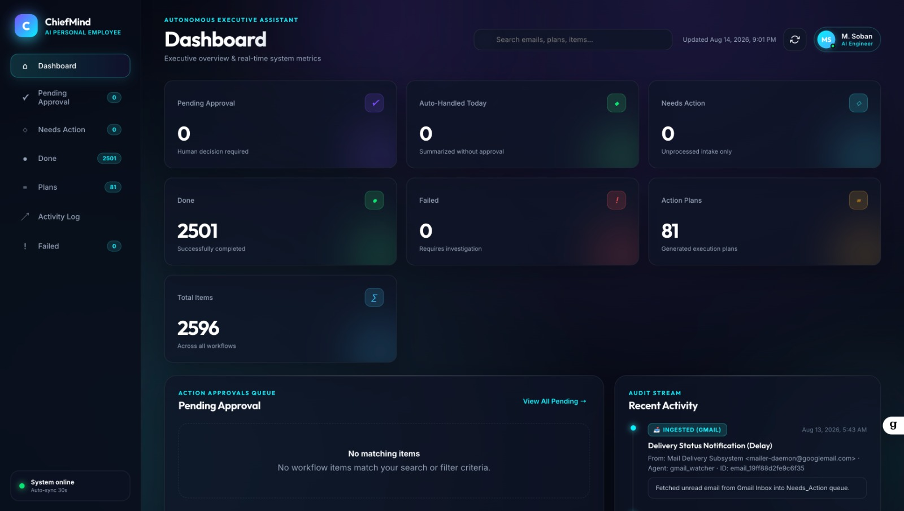
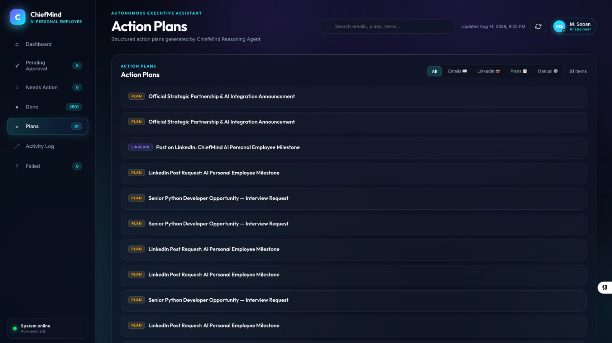
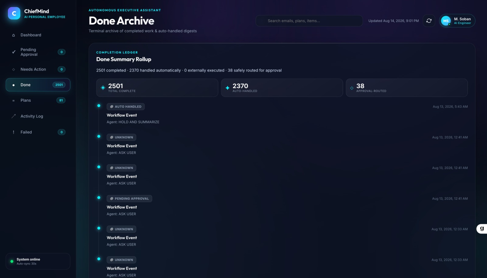
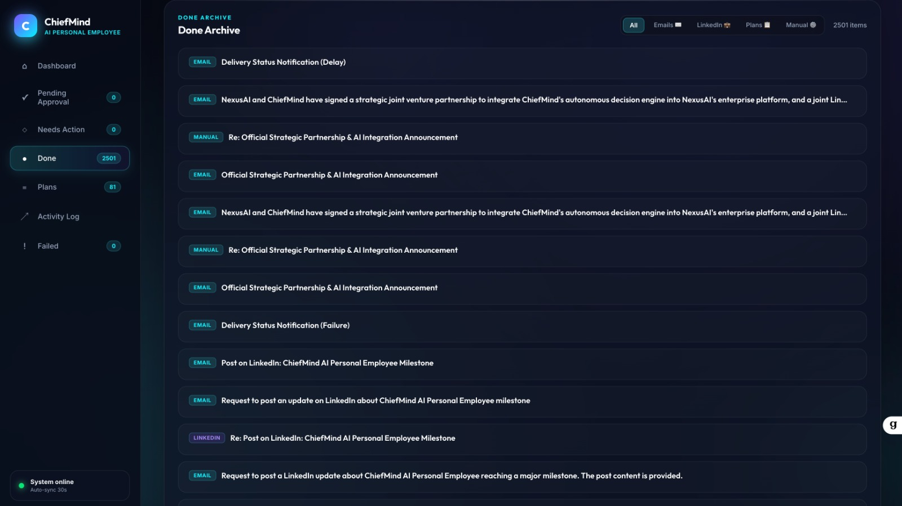
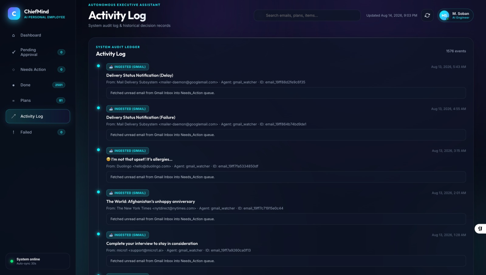
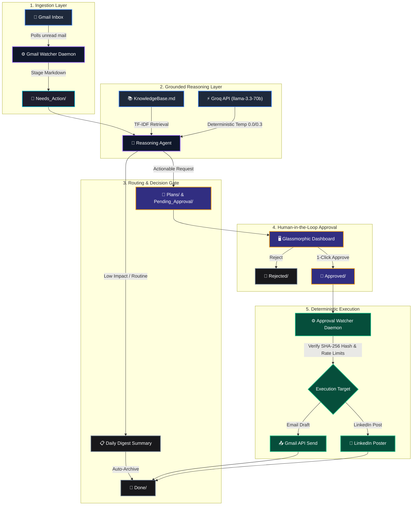

<div align="center">

# 🧠 ChiefMind — Autonomous AI Personal Employee

**A production-grade, local-first AI personal executive assistant and autonomous workflow engine.**

Grounded Reasoning · Cryptographic Approval Gate · Zero-Cloud File State · Real-Time Glassmorphic Dashboard · Audit Receipts

<br/>

[](https://www.python.org/)
[](https://flask.palletsprojects.com/)
[](https://groq.com/)
[](https://developers.google.com/gmail/api)
[](https://python-watchdog.readthedocs.io/)
[](https://modelcontextprotocol.io/)
[](LICENSE)
[](docs/DEPLOYMENT.md)

<br/>
<br/>
</div>

---

## 💡 What is ChiefMind?

**ChiefMind** is an autonomous AI Personal Employee designed to manage daily operations, communications, and job leads. It continuously monitors intake channels (Gmail, LinkedIn, Job Feeds), parses unstructured messages into structured file-system state, performs grounded multi-step reasoning using Groq LLM and local knowledge retrieval, and stages executable drafts—pausing before every external action to guarantee human-in-the-loop authorization.

> [!IMPORTANT]
> **Human-in-the-Loop Invariant (Rule 4):**
> LLM classifications and generated drafts **never execute external actions autonomously**. Outbound emails or posts are dispatched **only** when a human explicitly approves an immutable artifact (`Pending_Approval/` → `Approved/`) through the protected local dashboard interface.

---

## 🖥️ Dashboard & Interface Showcase

The ChiefMind frontend is a dark-mode glassmorphic single-page application engineered with Vanilla CSS and modern web ergonomics for high-velocity executive triage.

<div align="center">

### 🌟 1. Executive Dashboard & Real-Time KPI Metrics
*Live overview displaying pending approval queue, auto-handled digests counter, execution metrics, and real-time intake stream.*

<br/>

<a href="docs/screenshots/dashboard_overview.jpeg">
  
</a>

<br/>
<br/>

<table>
  <tr>
    <td width="50%" align="center" valign="top">
      <h4>📋 Structured Action Plans</h4>
      <a href="docs/screenshots/action_plans.jpeg">
        
      </a>
      <br/>
      <sub>Categorized actionable plans (Email, LinkedIn, Tasks) synthesized by Reasoning Agent</sub>
    </td>
    <td width="50%" align="center" valign="top">
      <h4>📊 Completion Ledger & Rollup</h4>
      <a href="docs/screenshots/done_archive_summary.jpeg">
        
      </a>
      <br/>
      <sub>Rollup metrics tracking automated routines vs approval-routed workflows</sub>
    </td>
  </tr>
  <tr>
    <td width="50%" align="center" valign="top">
      <h4>🗄️ Completed Work Archive</h4>
      <a href="docs/screenshots/done_archive_items.jpeg">
        
      </a>
      <br/>
      <sub>Searchable history of executed external dispatches and processed intake</sub>
    </td>
    <td width="50%" align="center" valign="top">
      <h4>📜 System Audit Stream</h4>
      <a href="docs/screenshots/activity_log.jpeg">
        
      </a>
      <br/>
      <sub>Immutable background audit trail documenting ingestion timestamps and decisions</sub>
    </td>
  </tr>
</table>

</div>

---

## 🌟 Key Features

| Capability | Highlights & Mechanism |
| :--- | :--- |
| 📬 **Autonomous Intake Engine** | Daemon polls unread emails, strips HTML bloat, extracts plain text, and stages deterministic Markdown/YAML artifacts in `Needs_Action/`. Uses unique Gmail Message IDs to prevent duplicate processing. |
| 🧠 **Grounded Knowledge Reasoning** | Integrates local keyword retriever (`knowledge.py`) to search `docs/KnowledgeBase.md` before prompting Groq (`llama-3.3-70b-versatile`). Prevents hallucinations and ensures auditable responses. |
| 🛡 **Cryptographic SHA-256 Approval Gate** | Pending proposals include a `draft_sha256` hash of the exact proposed reply. If modified without re-authorization, execution fails closed. Execution uses exact approved text with zero LLM re-generation. |
| 🖥 **Live Glassmorphic Dashboard** | Single-page web dashboard built with Flask and Vanilla CSS/JS featuring live KPI tracking, instant 1-click Approve/Reject buttons, activity timeline, and auto-handled daily digest views. |
| 💼 **Technical Job Lead Finder** | Autonomous background process scrapes remote technical job feeds, scores candidate skill matches against `candidate_profile.json`, filters irrelevant roles, and stages verified leads. |
| 🔌 **Model Context Protocol (MCP) Server** | Node.js MCP server in `mcp-servers/gmail-send/` exposing explicit development tool integration for desktop agent host execution. |

---

## 📐 System Architecture & Workflow Pipeline



---

## 📑 Human-in-the-Loop State Machine Contract

State transition workflow relies strictly on local directories. Every state transition is atomic and auditable.

| State Directory | Purpose | Written By | Triggered Action |
| :--- | :--- | :--- | :--- |
| `Inbox/` | Intake landing folder for raw files | Operator / Systems | Ingested by `gmail_watcher.py` |
| `Needs_Action/` | Staged un-processed items requiring LLM analysis | Gmail Watcher | Processed by `reasoning_loop.py` |
| `Plans/` | Generated step-by-step resolution plans | Reasoning Agent | Rendered in Dashboard UI |
| `Pending_Approval/` | Staged proposals awaiting human approval | Reasoning Agent | Human review via Dashboard |
| `Approved/` | Human-authorized items queued for dispatch | Dashboard User | Picked up by `approval_watcher.py` |
| `Rejected/` | User-rejected proposals | Dashboard User | Archived locally (no external action) |
| `Done/` | Fully executed items with audit metadata | Approval Watcher | Historical ledger & metrics |
| `Failed/` | Items failing schema checks or rate limits | System Daemons | Quarantined for developer inspection |

---

## 🚀 Quick Start Guide

### Prerequisites
- **Python 3.11+**
- **Node.js 18+** (for dev MCP server & frontend tooling)
- **`uv` Package Manager**

```bash
# Verify environment runtimes
python3 --version
node --version
uv --version
```

If `uv` is not installed, install it via:
```bash
curl -LsSf https://astral.sh/uv/install.sh | sh
```

---

### Step 1 — Clone Repository & Install Dependencies

```bash
git clone https://github.com/Sobanshahid10/ai-personal-employee.git
cd ai-personal-employee

# Install dependencies into virtualenv using uv
uv pip install flask pyyaml python-dotenv groq google-api-python-client google-auth-httplib2 google-auth-oauthlib watchdog
```

---

### Step 2 — Configure Environment Variables

Copy the template file to create your active `.env` configuration:

```bash
cp scripts/.env.example scripts/.env
```

Edit `scripts/.env` with your API credentials and security token:

```dotenv
# API Keys & Secrets
GROQ_API_KEY=gsk_your_real_groq_api_key_here
DASHBOARD_APPROVAL_TOKEN=your_secure_approval_token_here

# Runtime Settings
GMAIL_POLL_INTERVAL=120
GMAIL_QUERY=is:unread
DASHBOARD_HOST=127.0.0.1
DASHBOARD_PORT=5055

# Execution Controls
LINKEDIN_MODE=mock
AUTO_LINKEDIN_POSTS=false
MAX_EMAIL_SENDS_PER_HOUR=10
MAX_EXTERNAL_ACTIONS_PER_DAY=50
```

---

### Step 3 — Authenticate Gmail OAuth

Place your Google Cloud OAuth client secrets file as `credentials/credentials.json`, then execute:

```bash
uv run python scripts/authenticate_gmail.py
```
> *This launches a browser session to perform Google OAuth authorization and atomically saves `credentials/token.json`.*

---

### Step 4 — Launch ChiefMind Supervisor

Start all core services (Gmail intake daemon, reasoning engine, approval watcher, and web dashboard) via the unified supervisor:

```bash
uv run python scripts/main.py
```

Access the Executive Dashboard at: **[http://127.0.0.1:5055](http://127.0.0.1:5055)**

---

## ⚙️ Environment Variables Reference

| Variable | Description | Default Value | Required |
| :--- | :--- | :--- | :--- |
| `GROQ_API_KEY` | Groq API Key for LLM classification & drafting | `""` | **Yes** |
| `GROQ_MODEL` | Target Groq LLM model architecture | `llama-3.3-70b-versatile` | No |
| `GMAIL_QUERY` | Gmail search filter for intake polling | `is:unread` | No |
| `GMAIL_POLL_INTERVAL` | Polling frequency in seconds (minimum 60s) | `120` | No |
| `DASHBOARD_HOST` | Host interface binding for REST API & Dashboard | `127.0.0.1` | No |
| `DASHBOARD_PORT` | HTTP port for REST API & Dashboard | `5055` | No |
| `DASHBOARD_APPROVAL_TOKEN` | Bearer token secret required for approval API calls | `""` | Optional |
| `LINKEDIN_MODE` | Execution mode for LinkedIn adapter (`mock`, `live`, `browser`) | `mock` | No |
| `MAX_EMAIL_SENDS_PER_HOUR` | Outbound email hourly rate-limit threshold | `10` | No |
| `MAX_EXTERNAL_ACTIONS_PER_DAY` | Circuit breaker threshold for daily external actions | `50` | No |

---

## 📋 REST API Reference

The Flask backend serves both the SPA layout and JSON endpoints for system management:

| Method | Endpoint | Description |
| :--- | :--- | :--- |
| `GET` | `/` | Serves the single-page glassmorphic dashboard web application |
| `GET` | `/api/stats` | Returns real-time KPI counts, execution stats, and recent event logs |
| `GET` | `/api/folder/<key>` | Lists Markdown items in state folder (`pending_approval`, `plans`, `done`, `failed`) |
| `GET` | `/api/file/<folder>/<name>` | Returns frontmatter metadata and parsed body content of a specific file |
| `POST` | `/api/approve/<name>` | Atomically moves item from `Pending_Approval/` to `Approved/` |
| `POST` | `/api/reject/<name>` | Atomically moves item from `Pending_Approval/` to `Rejected/` |
| `GET` | `/api/logs` | Retrieves system-wide combined audit log events |
| `GET` | `/api/digest` | Returns auto-handled daily digest summaries |
| `GET` | `/api/done-summary` | Returns detailed statistics and ledger of completed tasks |

---

## 🧪 Automated Testing Suite

The repository includes a comprehensive unit and end-to-end simulation test suite. Run tests using `unittest`:

```bash
# Run Flask REST API & Dashboard tests
uv run python -m unittest dashboard/test_app.py

# Run script modules and workflow pipeline tests
uv run python -m unittest discover -s scripts
```

### Test Suite Breakdown

| Test Script | Coverage & Validation Focus |
| :--- | :--- |
| `dashboard/test_app.py` | Validates REST API endpoints, CORS policies, atomic file moves, path traversal prevention, and payload rendering. |
| `scripts/test_pipeline.py` | End-to-end integration test simulating email intake → reasoning → draft hashing → approval → external send. |
| `scripts/test_reasoning_loop.py` | Validates Groq LLM prompt parsing, decision mapping, digest generation, and plan formatting. |
| `scripts/test_approval_watcher.py` | Tests SHA-256 draft integrity checks, rate limit circuit breakers, and receipt ledger writes. |
| `scripts/test_knowledge.py` | Tests TF-IDF keyword extraction and document section retrieval over `KnowledgeBase.md`. |
| `scripts/test_linkedin_poster.py` | Validates LinkedIn mock mode execution and Posts API request formatting. |

---

## 🗂 Project Structure

```
ai-personal-employee/
├── AGENTS.md                    # System architectural contracts & agent rules
├── README.md                    # Project documentation hub
├── dashboard/
│   ├── app.py                   # Flask REST API server backend
│   ├── test_app.py              # API test suite
│   └── static/
│       ├── index.html           # Dashboard single-page application layout
│       ├── app.js               # Dynamic UI rendering & approval logic
│       └── style.css            # Dark glassmorphic design system styling
├── docs/
│   ├── DEPLOYMENT.md            # Daemon deployment guide (launchd / systemd)
│   ├── GUARDRAILS.md            # Security rules & rate limit policies
│   ├── KnowledgeBase.md         # Reference knowledge document for grounding
│   └── screenshots/             # Glassmorphic UI & dashboard screenshots
├── scripts/
│   ├── .env.example             # Environment template
│   ├── config.py                # Centralized paths and configuration loader
│   ├── authenticate_gmail.py    # Interactive Gmail OAuth setup script
│   ├── gmail_watcher.py         # Gmail polling & intake daemon
│   ├── reasoning_loop.py        # LLM reasoning & plan drafting agent
│   ├── knowledge.py             # Keyword retrieval module
│   ├── approval_watcher.py      # Execution agent & approval monitor
│   ├── linkedin_poster.py       # LinkedIn API / mock adapter
│   ├── job_search_agent.py      # Technical job lead discovery agent
│   ├── workflow_utils.py        # Atomic file utilities & frontmatter parser
│   ├── main.py                  # Multi-threaded supervisor entry point
│   └── test_*.py                # Component test suites
├── mcp-servers/gmail-send/      # Development-only MCP server (Node.js)
├── launchd/                     # macOS LaunchAgent configuration templates
├── systemd/                     # Linux systemd service configuration templates
├── Inbox/                       # Landing folder for incoming data
├── Needs_Action/                # Staged intake files awaiting analysis
├── Plans/                       # Step-by-step action plans
├── Pending_Approval/            # Proposals awaiting human approval
├── Approved/                    # Approved proposals queued for execution
├── Rejected/                    # User-rejected items archive
├── Done/                        # Completed execution ledger
├── Failed/                      # Quarantined failed execution items
└── Logs/                        # Rotating system audit logs & receipts
```

---

## 🛡 Security & Operational Invariants

1. **Immutable Draft Execution:** The execution agent dispatches **only** the exact text authorized by the human operator. It never rewrites, summarizes, or invokes an LLM during execution.
2. **Cryptographic Draft Verification:** Approval artifacts store a SHA-256 hash (`draft_sha256`) of the proposed body. Any unauthorized post-approval modification invalidates the hash and aborts execution.
3. **Atomic File Transitions:** All file-system operations write to temporary files before performing atomic renames, preventing partial reads by background threads.
4. **Local-First Privacy:** All credentials, tokens, logs, and workflow files remain on local storage and are strictly excluded from git tracking.
5. **Fail-Closed Thresholds:** Enforces hourly email caps and daily action circuit breakers to prevent run-away background execution.

---

## 👤 Author & Maintainer

**Muhammad Soban**  
AI Engineer  
Department of Artificial Intelligence  
University of Management and Technology, Lahore, Pakistan  

[](https://github.com/Sobanshahid10/ai-personal-employee)

---

<div align="center">

<sub>ChiefMind is built for absolute human agency. AI generates recommendations — humans retain absolute control.</sub>

</div>
