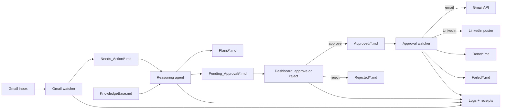

# ChiefMind — AI Personal Employee

ChiefMind is a local-first assistant that watches a Gmail inbox, turns relevant
messages into structured work, drafts grounded replies, and pauses before every
external action so a person can review the exact result. After approval it sends
the exact approved text, records a durable receipt, and exposes the complete
workflow through a private dashboard. Its shared state is ordinary Markdown and
JSON files on your machine—there is no workflow database or cloud file store.

## Architecture



The decisive boundary is `Pending_Approval/`. The LLM may propose an action,
but only a human can move its immutable artifact into `Approved/`.

## Features

| Capability | What ChiefMind does |
| --- | --- |
| Gmail intake | Polls a configurable query, extracts complete message bodies, stages Markdown, and marks processed mail read |
| Grounded reasoning | Retrieves auditable knowledge-base sections before classifying and drafting |
| Human approval | Displays pending work, metadata, and exact content with Approve/Reject controls |
| Exact execution | Sends the approved `draft_body` without another LLM call or rewrite |
| Duplicate protection | Uses Gmail IDs, `action_id`, processed IDs, and execution receipts |
| Rate protection | Enforces hourly email and daily external-action/LinkedIn limits |
| Dashboard | Shows KPIs, queues, file details, activity logs, and approval actions |
| LinkedIn | Safe mock mode, official Posts API mode, and an explicitly gated browser fallback |
| Job discovery | Finds and scores remote/Pakistan junior technical roles while rejecting unrelated and senior listings |
| Local MCP tool | Exposes a disabled-by-default Gmail send tool for development—not production execution |
| Supervision | Runs interactively through `main.py` or continuously through launchd/systemd |
| Auditability | Writes rotating agent logs, dated JSON events, and durable execution receipts |

## Project structure

```text
chiefmind/
├── README.md
├── AGENTS.md
├── dashboard/
│   ├── app.py
│   ├── test_app.py
│   └── static/{index.html,style.css,app.js}
├── docs/
│   ├── DEPLOYMENT.md
│   ├── GUARDRAILS.md
│   └── KnowledgeBase.md
├── scripts/
│   ├── .env.example
│   ├── config.py
│   ├── authenticate_gmail.py
│   ├── gmail_watcher.py
│   ├── reasoning_loop.py
│   ├── knowledge.py
│   ├── approval_watcher.py
│   ├── linkedin_poster.py
│   ├── job_search_agent.py
│   ├── workflow_utils.py
│   ├── main.py
│   ├── test_pipeline.py
│   └── pyproject.toml
├── mcp-servers/gmail-send/
│   ├── index.js
│   └── package.json
├── launchd/*.plist.template
├── systemd/*.service.template
├── credentials/                 # ignored private OAuth files
├── Inbox/
├── Needs_Action/
├── Plans/
├── Pending_Approval/
├── Approved/
├── Rejected/
├── Done/
├── Failed/
└── Logs/                        # ignored runtime logs and receipts
```

## Technology stack

| Layer | Technology |
| --- | --- |
| Runtime | Python 3.11+, Node.js 18+ |
| Package management | `uv`, npm |
| Email | Gmail API and Google OAuth 2.0 |
| Reasoning | Groq API with configurable model |
| Knowledge retrieval | Auditable keyword overlap over Markdown sections |
| API and UI | Flask, HTML, CSS, browser JavaScript |
| File monitoring | watchdog |
| Structured artifacts | Markdown, YAML frontmatter, JSON receipts/logs |
| Optional browser automation | Playwright Chromium |
| Development tool protocol | Model Context Protocol over stdio |
| Service management | launchd on macOS, systemd user services on Linux |
| Tests | Python `unittest`, Node test runner |

## Setup

### 1. Install prerequisites

Confirm the required runtimes:

```bash
python3 --version
node --version
uv --version
git --version
```

ChiefMind requires Python 3.11 or newer and Node.js 18 or newer. Install `uv`
if it is missing:

```bash
curl -LsSf https://astral.sh/uv/install.sh | sh
```

### 2. Install dependencies

From the repository root:

```bash
cd scripts
uv sync
uv run playwright install chromium

cd ../mcp-servers/gmail-send
npm install

cd ../..
```

Chromium is only required for the optional LinkedIn browser fallback. Official
LinkedIn API and mock modes do not use it.

### 3. Create private configuration

```bash
cp scripts/.env.example scripts/.env
chmod 600 scripts/.env
```

At minimum, set these real values in `scripts/.env`:

```dotenv
GROQ_API_KEY=replace_with_your_real_key
DASHBOARD_APPROVAL_TOKEN=replace_with_a_long_random_secret
GMAIL_POLL_INTERVAL=120
LINKEDIN_MODE=mock
AUTO_LINKEDIN_POSTS=false
MCP_GMAIL_SEND_ENABLED=false
```

Keep the 120-second Gmail interval in production. The code rejects values below
60 seconds. Generate a dashboard token with a password manager or:

```bash
openssl rand -hex 32
```

### 4. Configure Gmail OAuth

1. Create a Google Cloud project.
2. Enable the Gmail API.
3. Configure the OAuth consent screen and add your account as a test user when
   the app is in Testing status.
4. Create a Desktop application OAuth client.
5. Download it as `credentials.json` and place it in `credentials/`.
6. Run the one-time authorization:

```bash
scripts/.venv/bin/python scripts/authenticate_gmail.py
```

Successful authorization creates the ignored `credentials/token.json`.

### 5. Validate configuration and tests

```bash
scripts/.venv/bin/python scripts/main.py --check

cd scripts
uv run python test_pipeline.py
cd ..

scripts/.venv/bin/python -m unittest -v \
  scripts.test_pipeline \
  scripts.test_workflow_utils \
  scripts.test_main \
  scripts.test_knowledge \
  scripts.test_reasoning_loop \
  scripts.test_approval_watcher \
  scripts.test_linkedin_poster \
  dashboard.test_app
```

Do not proceed until validation reports success and the tests end with `OK`.

## Run locally

### Recommended single command

The supervisor starts Gmail intake, approval execution, and the dashboard while
the reasoning loop is triggered automatically when new mail is staged:

```bash
scripts/.venv/bin/python scripts/main.py
```

Open [http://127.0.0.1:5000](http://127.0.0.1:5000). Stop everything with one
Ctrl+C.

### Four-terminal development layout

Use this only while debugging components. Do not run it alongside `main.py` or
installed daemons.

Terminal 1 — Gmail intake and automatic reasoning:

```bash
scripts/.venv/bin/python scripts/gmail_watcher.py
```

Terminal 2 — approved-action execution:

```bash
scripts/.venv/bin/python scripts/approval_watcher.py
```

Terminal 3 — dashboard:

```bash
scripts/.venv/bin/python dashboard/app.py
```

Terminal 4 — optional development-only Gmail MCP server:

```bash
cd mcp-servers/gmail-send
MCP_GMAIL_SEND_ENABLED=false npm start
```

The reasoning agent is not a fourth daemon: Gmail watcher launches it after a
new message is staged. Run it manually when debugging existing files:

```bash
scripts/.venv/bin/python scripts/reasoning_loop.py
```

## Production operation

ChiefMind includes three launchd and three systemd templates. Validate private
configuration first, stop any interactive ChiefMind processes, then follow
[docs/DEPLOYMENT.md](docs/DEPLOYMENT.md). Production runs:

- Gmail watcher
- approval watcher
- Flask dashboard

The MCP server is deliberately excluded from production. On macOS, rendered
LaunchAgents are installed with `launchctl bootstrap`; on Linux, rendered user
services are installed with `systemctl --user enable --now`.

## Human-in-the-loop contract

```text
LLM creates proposal
        │
        ▼
Pending_Approval/email_<id>.md
  contains exact draft_body + hash
        │
        ├── Reject ──> Rejected/ (nothing external happens)
        │
        └── Approve ─> Approved/
                           │
                           ▼
                  duplicate + rate checks
                           │
                           ▼
                  send exact draft_body
                           │
                           ▼
                  receipt + audit + Done/
```

Approval means approving the exact artifact. The execution agent never calls
the LLM, edits the draft, adds a signature, or regenerates text. If content must
change, reject it and create a new artifact.

## End-to-end demo

1. Start `scripts/main.py` and open the dashboard.
2. Send a uniquely titled email from an address that can receive the reply.
3. Wait up to `GMAIL_POLL_INTERVAL` and inspect `Needs_Action/`.
4. Confirm a plan in `Plans/` and artifact in `Pending_Approval/`.
5. Open the artifact in the dashboard and review recipient, subject, and every
   line of `draft_body`.
6. Select Approve and provide the dashboard token if prompted.
7. Confirm the reply arrives, the artifact moves to `Done/`, and dated JSON
   logs plus `execution_receipts.json` contain the action.

The detailed action/expected-result/troubleshooting checklist is in
[docs/DEPLOYMENT.md](docs/DEPLOYMENT.md#end-to-end-production-demo).

## Security considerations

- `credentials/`, `scripts/.env`, workflow data, and logs are ignored by Git.
- Keep file permissions private and bind the dashboard to `127.0.0.1` unless an
  authenticated HTTPS reverse proxy is deliberately added.
- The dashboard token is stored in browser `sessionStorage`, so it expires with
  the tab; it is still JavaScript-readable, making XSS prevention essential.
- Workflow-controlled content is rendered with `textContent`, not `innerHTML`.
- YAML uses safe loaders, writes are atomic, and path traversal/symlinks are
  rejected by the dashboard.
- Execution reservations are written before external I/O to fail closed after
  crashes, and `action_id` prevents repeat execution.
- Outbound thresholds limit email sends, LinkedIn posts, and total external
  actions. Reaching a limit routes the artifact to `Failed/` without sending.
- LinkedIn and MCP external actions are disabled by default.
- Review [docs/GUARDRAILS.md](docs/GUARDRAILS.md) before changing any safety
  threshold or enabling public posting.

## Foundational principles

1. The file system is shared state; agents exchange Markdown with YAML.
2. `scripts/config.py` is the only source of runtime paths and constants.
3. The approved draft is sacred and immutable.
4. Startup validation fails loudly with actionable errors.
5. Stable IDs and receipts make repeated runs safe.
6. Humans approve the exact external action.
7. Private data remains local and is never committed.

## Documentation

- [Agent reference](AGENTS.md)
- [Deployment and end-to-end demo](docs/DEPLOYMENT.md)
- [Guardrails and risk policy](docs/GUARDRAILS.md)
- [Knowledge base](docs/KnowledgeBase.md)
